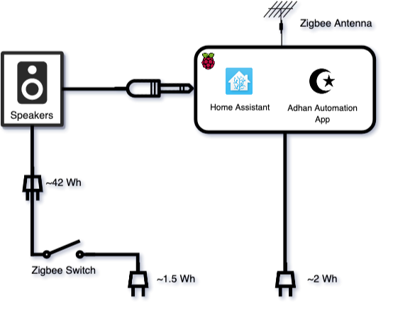

# Adhan HomeAssistant Pi

 

This automation app runs Adhan 5 times a day by switching on the speakers before the
adhan and switching them off directly after. It allows playing Adhan on multi 
channel speakers, using raspberry pi's ~2W instead of having the speakers switched on 
(~42W) for a long period of time. Proposal design doc: [here](https://docs.google.com/document/d/1jaiPn7vfulNgkbaxgMCdkzdQyKv2k5WcBebXyMKO92E/edit#heading=h.tgmxtralkmm7).

## Hardware Setup

### Components

* Raspberry pi with auxillary i.e. any raspberry pi that is not Zero.
    * Micro SD Card reader.
    * Compatible USB power supply.
* Zigbee Antenna e.g. SONOFF Zigbee 3.0 USB Dongle Plus,TI CC2652P + CP2102(N).
* Zigbee compatible Smart Plug/Switch e.g. Innr SmartPlug Zigbee 3.0 Type F.
* Old speakers with auxillary.

### Setup

1. Connect the Zigbee Antenna to the raspberry pi via USB.
2. Connect the speakers to the raspberry pi via aux.
3. Connect the speakers to the Zigbee switch.

## Setup

Follow [setup from scratch](https://github.com/ssafty/adhan-homeassistant-pi/wiki#setup-from-scratch).

## Contributing

See [`CONTRIBUTING.md`](CONTRIBUTING.md) for details.

## License

Apache 2.0; see [`LICENSE`](LICENSE) for details.

## Disclaimer

This project is not an official Google project. It is not supported by
Google and Google specifically disclaims all warranties as to its quality,
merchantability, or fitness for a particular purpose.
